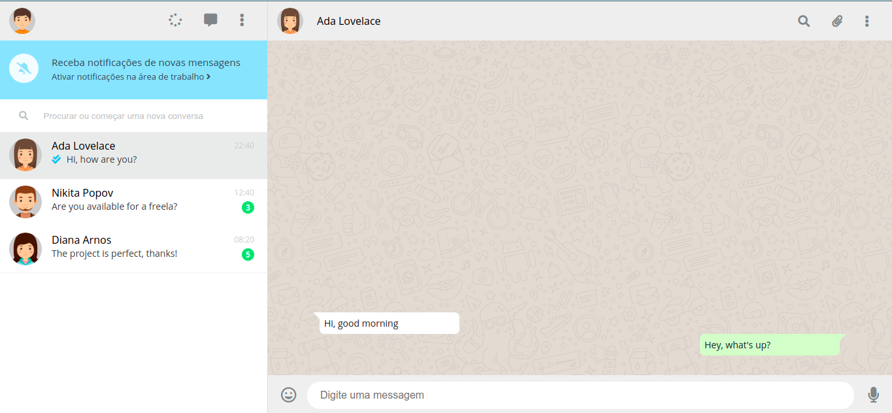

<h1 align="center">whatsapp-web-clone</h1>

<h1 align="center">
    
</h1>

<h4 align="center"> 
	🚧  whatsapp-web-clone 🚀 concluído  🚧
</h4>

## Sobre o projeto

Projeto desenvolvido no curso HTML5 e CSS3: Técnicas Avançadas do Hora de Codar

### 🛠 Tecnologias

Este projeto foi feito com as seguintes tecnologias:
- HTML
- CSS

### IDE

- [Visual Studio Code](https://code.visualstudio.com/)

## 🦸 Autor
<h4 align="center">
  Feito por nelynely <a href="https://www.linkedin.com/in/f-nely/">Entre em contato!</a>
</h4>